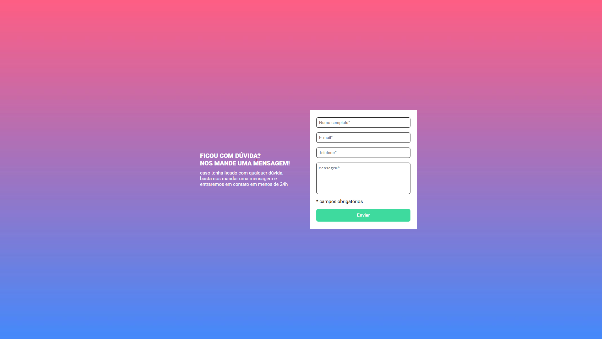
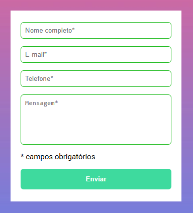
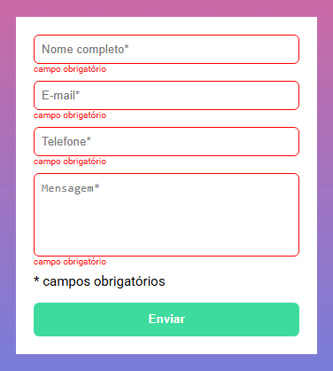

# Formulário com Validação

### Projeto que mostra uma página de envio de mensagem com estilização e formatação profissionais, visando coletar dados e a mensagem do usuário

### De acordo com a imagem é possível ver todas as caixas com as informações necessárias para a identificação e armazenamento da mensagem do usuário

### Caso o usuário falte com alguma informação, a caixa com a informação faltando ficará vermelha, e aparecerá uma mensagem informando que o campo é obrigatório

### No caso de tudo estar certo as caixas ficarão verdes e o dado será armazenado

  
  

### Linguagens Utilizadas:
- HTML5
- CSS3
- JavaScript